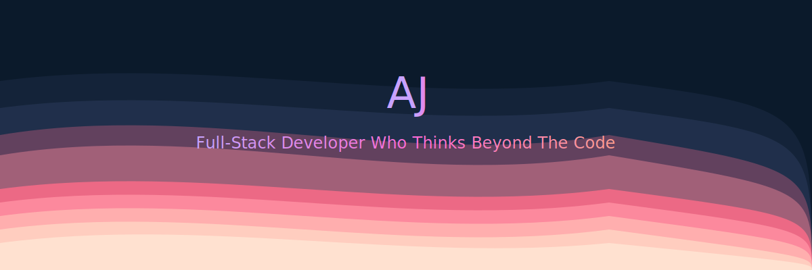

  

---

## 👋 Who Am I

I'm someone who bridges creativity, technology, and human insight.  
I don't just build products — I think about **the impact behind the idea**, combining design, logic, and intention to create digital experiences that people actually connect with.

**What makes me different?**  
I understand enough across design, business, and software development to connect disciplines that usually stay apart.  
I'm hands-on with tech, but what defines me is **how I think**: critically, strategically, and always one step ahead of the problem.

I'm detail-driven, analytical, and someone who overthinks until things make perfect sense.  
That mindset helps me spot patterns, weaknesses, and opportunities others miss.

---

## 🚀 What I'm Building Right Now

### **Interactive Portfolio Website** (In Progress)
A two-layer experience showcasing both personality and professionalism — because portfolios shouldn't be boring.  
🎯 **Layer 1:** The Professional Portal (multicultural journey, interests, Easter eggs)  
💼 **Layer 2:** The Experience(OS simulator-style interface with AI chatbot)

### **AI Traffic Light Automation** (Group Project)
Applying AI to urban infrastructure challenges — optimizing traffic flow through intelligent system design.

---

## 🛠️ Tech Stack

---

## 📊 GitHub Activity

---

## 💡 Philosophy

> **"I care about the impact behind an idea — seeing how design, logic, and intention can shape something people actually connect with."**

I take concepts (mine or others') and turn them into meaningful digital products that balance **vision with function**.  
My goal is to keep building work that matters: products where humans and technology meet in smart, intentional ways.

---

## 🤝 Let's Connect

I'm open to remote opportunities with **startups and creative agencies** that value cross-disciplinary thinking and meaningful product development.

  
  

**Currently based in Eindhoven, Netherlands 🇳🇱**  
**Available for remote positions**

---

*"Overthinking until it makes perfect sense."*

